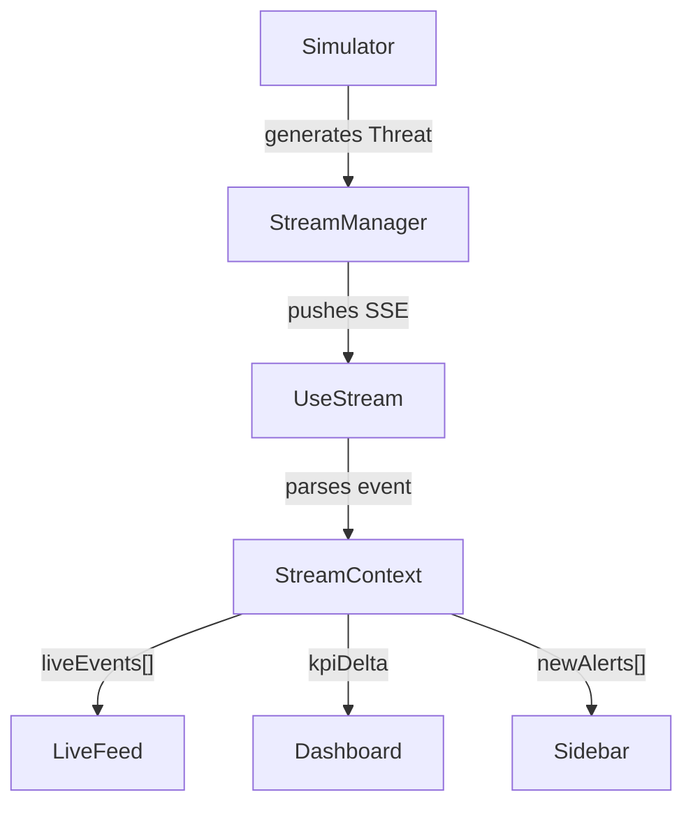
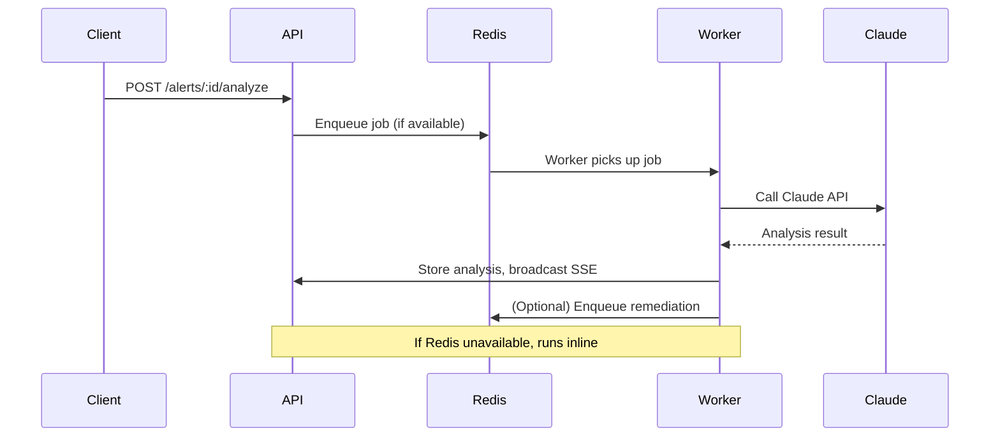

# 🦅 HawkEye AI — Cybersecurity Threat Intelligence Platform

HawkEye AI is a full-stack, production-ready cybersecurity threat intelligence platform. It provides real-time threat streaming, AI-powered analysis, alert queueing, RAG-based log intelligence, and robust RBAC authentication. Built as a monorepo with modern TypeScript, React, Express, Prisma, and Docker.

---

## Table of Contents

1. [Features](#features)
2. [Architecture](#architecture)
3. [Quick Start](#quick-start)
4. [Usage](#usage)
5. [API Reference](#api-reference)
6. [Demo Credentials](#demo-credentials)
7. [Contributing](#contributing)
8. [License](#license)
9. [Contact](#contact)

---

## Features

| Phase | Feature | Stack |
|-------|---------|-------|
| 1 | Real-time SSE threat stream | Express · EventSource |
| 2 | Claude AI auto-analysis | Anthropic SDK · streaming |
| 3 | BullMQ alert queue + auto-remediation | Redis · BullMQ |
| 4 | PostgreSQL persistence | Prisma · Docker |
| 5 | RAG log intelligence | Claude · pgvector |
| 6 | JWT auth + RBAC | bcryptjs · jsonwebtoken |

---

## Architecture

```
hawkeye/
├── docker-compose.yml          # Postgres 16 + Redis 7 + pgAdmin + Redis UI
├── backend/
│   ├── prisma/
│   │   ├── schema.prisma       # DB schema (User, Threat, Alert, Analysis, Log)
│   │   └── init.sql            # Postgres init (pgvector extension)
│   └── src/
│       ├── index.ts            # Express server — mounts all routers
│       ├── routes/
│       │   ├── api.ts          # REST + SSE — all protected by requireAuth
│       │   └── auth.ts         # Auth endpoints
│       ├── services/           # Store, stream, simulator, AI, queue, RAG
│       ├── lib/                # Auth, DB, Redis helpers
│       └── middleware/         # Logger, error handler
└── frontend/
    └── src/
        ├── App.tsx             # Router + RequireAuth guard
        ├── lib/                # Auth, API, context
        ├── hooks/              # useStream, useSecurityData
        ├── pages/              # Dashboard, Threats, Alerts, Investigation, etc.
        └── components/         # Layout, charts, UI widgets
```

---

## Quick Start

### 1. Install dependencies

```bash
npm run install:all
```

### 2. Configure environment

```bash
cp backend/.env.example backend/.env
# Edit backend/.env and set:
ANTHROPIC_API_KEY=sk-ant-your-key-here   # required for live AI
```

### 3. Start infrastructure (Postgres + Redis)

```bash
npm run infra:up
```
This starts:
- PostgreSQL at `localhost:5432`
- Redis at `localhost:6379`
- Redis Commander UI at `http://localhost:8081`
- pgAdmin UI at `http://localhost:5050` (login: admin@hawkeye.ai / admin123)

### 4. Set up the database

```bash
npm run db:setup
```
Generates Prisma client and pushes schema to PostgreSQL.

### 5. Start the app

```bash
npm run dev
```

| Service      | URL                          |
|--------------|------------------------------|
| Frontend     | http://localhost:5173        |
| Backend API  | http://localhost:4000/api    |
| SSE Stream   | http://localhost:4000/api/stream |
| Health check | http://localhost:4000/api/health |
| Redis UI     | http://localhost:8081        |
| pgAdmin      | http://localhost:5050        |

---

## Usage

### Real-Time Data Flow



### BullMQ Queue Flow



---

## API Reference

| Method | Endpoint | Auth | Role |
|--------|----------|------|------|
| POST   | /api/auth/login | ✗ | — |
| GET    | /api/auth/me | ✓ | Any |
| POST   | /api/auth/refresh | ✓ | Any |
| GET    | /api/auth/users | ✓ | ADMIN |
| GET    | /api/health | ✗ | — |
| GET    | /api/stream | ✗ | — |
| GET    | /api/analytics/summary | ✓ | Any |
| GET    | /api/threats | ✓ | Any |
| GET    | /api/threats/:id | ✓ | Any |
| POST   | /api/threats/:id/actions/block-ip | ✓ | ANALYST+ |
| POST   | /api/threats/:id/actions/resolve | ✓ | ANALYST+ |
| GET    | /api/alerts | ✓ | Any |
| POST   | /api/alerts/:id/analyze | ✓ | ANALYST+ |
| GET    | /api/alerts/:id/analysis | ✓ | Any |
| GET    | /api/queue/stats | ✓ | ADMIN |
| POST   | /api/logs/query | ✓ | Any |

---

## Demo Credentials

| Email              | Password   | Role    | Access                |
|--------------------|------------|---------|-----------------------|
| admin@hawkeye.ai   | admin123   | ADMIN   | Everything            |
| analyst@hawkeye.ai | analyst123 | ANALYST | Investigate + block   |
| viewer@hawkeye.ai  | viewer123  | VIEWER  | Read-only             |

---

## Without Docker (Optional)

You can run the app without Docker:
- No `DATABASE_URL` → uses in-memory store (data resets on restart)
- No `REDIS_URL` → BullMQ queue runs inline synchronously
- No `ANTHROPIC_API_KEY` → AI analysis returns mock responses

Just run:

```bash
npm run install:all && npm run dev
```

---

## Contributing

Contributions are welcome! Please open issues or submit pull requests for improvements and bug fixes.

---

## License

This project is licensed under the MIT License.

---

## Contact

For questions or support, contact [Sumit](mailto:sumit@example.com) or open an issue on [GitHub](https://github.com/ThisIsSumit/Hawkeye-AI).
